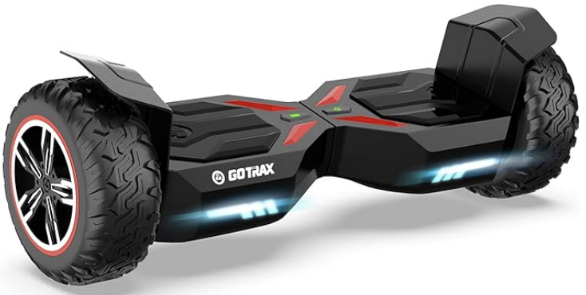

# Electrical
{: .no_toc }

## Table of contents
{: .no_toc .text-delta }

1. TOC
{:toc}
---

# 10/2/2023
## Battery & Motor Decision Matrix

| Description | Brushless 350W motor + 36V 10Ah Li-On | Brushed 250W DC motor + 24V 20Ah Lead acid | 36V 5Ah LiFePO4 +  350W brushless motor | Brushed 250W DC motor + 25V 15Ah Lead Acid |
|:--------------------|:-------------------|:-------------------|:-------------------|:--------------------|
| **Starting Torque** | 10 | 7 | 8 | 4 |
| **Longevity** | 8 | 5 | 8 | 4 |
| **Range** | 8 | 6 | 7 | 4 |
| **Size** | 5 | 6 | 8 | 3 |
| **Weight** | 4 | 3 | 8 | 3 |
| **Cost** | 3 | 5 | 6 | 9 |
| **Total** | 38 | 32 | **45** | 27 |

# 11/06/2023
## Motor Selection Progress
* Dual 250W in hub motors for driveline
* Three phase brushless speed controller with hall sensor support
* Electrically allows for e-brake, direction change, and coast to stop functionality

## Hoverboard Purchased
* A [Hoverboard](https://www.amazon.ca/dp/B09NDKKBH8?language=en-CA&ref_=cm_sw_r_apin_dp_FCHVW3Y5VHK1D3ENJAW9&th=1) was purchased for parts

Key specifications include:
* Dual 250W in hub motors
* 8.5" solid rubber offroad wheels for all terrain
* 36V 4AH lithium battery
* 12KM riding range

# 11/13/2023
## Motor Work Progress
* Work has begun on the hoverboard's motors to manually control them with a potentiometer

# 11/17/2023
## Motor Work Progress
* Able to successfully control the hoverboard's motors manually with a potentiometer

# 11/23/2023
## Motor Work Progress
* Able to successfully control the hoverboard's motors with a Raspberry Pi. The wheels can rotate in both directions and the brake can be successfully applied
* [Corresponding Software Work](#caddy-raspberry-pi-motor-control)

# 1/10/2024
## Motor Work Progress
* Able to successfully control the motors with a Raspberry Pi while connected to the caddy. The wheels can rotate in both directions and the brake can be successfully applied

