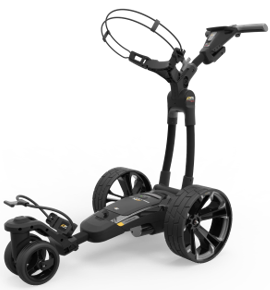

# Mechanical
{: .no_toc }

## Table of contents
{: .no_toc .text-delta }

1. TOC
{:toc}
---

# 10/2/2023
## Chassis Decision Matrix

||  |  |  |  |
| Description | 4 Wheel, Fixed Lead Wheelbase | 3 Wheel, Fixed Lead Wheelbase | 3 Wheel, Swivel Lead Wheelbase | 4 Wheel, Swivel Lead Wheelbase |
|:--------------------|:-------------------|:-------------------|:-------------------|:--------------------|
| **Stability** | 9 | 6 | 4 | 7 |
| **Maneuverability** | 5 | 7 | 9 | 8 |
| **Off-Road Ability** | 8 | 6 | 5.5 | 7.5 |
| **Size** | 7 | 9 | 9 | 8 |
| **Weight** | 6 | 8 | 8 | 5 |
| **Ease of Implementation** | 7 | 6 | 6 | 7 |
| **Total** | 42 | 42 | 41.5 | **42.5** |

## Chassis Decision Matrix - Bias Evaluation

||  |  |  |  |
| Description | 4 Wheel, Fixed Lead Wheelbase | 3 Wheel, Fixed Lead Wheelbase | 3 Wheel, Swivel Lead Wheelbase | 4 Wheel, Swivel Lead Wheelbase |
|:--------------------|:-------------------|:-------------------|:-------------------|:--------------------|
| **Original Total** | 42 | 42 | 41.5 | **42.5** |
| **Without Stability** | 33 | 36 | 37.5 | 35.5 |
| **Without Maneuverability** | 37 | 35 | 32.5 | 34.5 |
| **Without Off-Road Ability** | 34 | 36 | 36 | 35 |
| **Without Size** | 35 | 33 | 32.5 | 34.5 |
| **Without Weight** | 36 | 34 | 33.5 | 37.5 |
| **Without Ease of Implementation** | 35 | 36 | 35.5 | 35.5 |
| **Total** | 210 | 210 | 207.5 | **212.5** |

# 10/9/2023
## Preliminary Design Sketch
