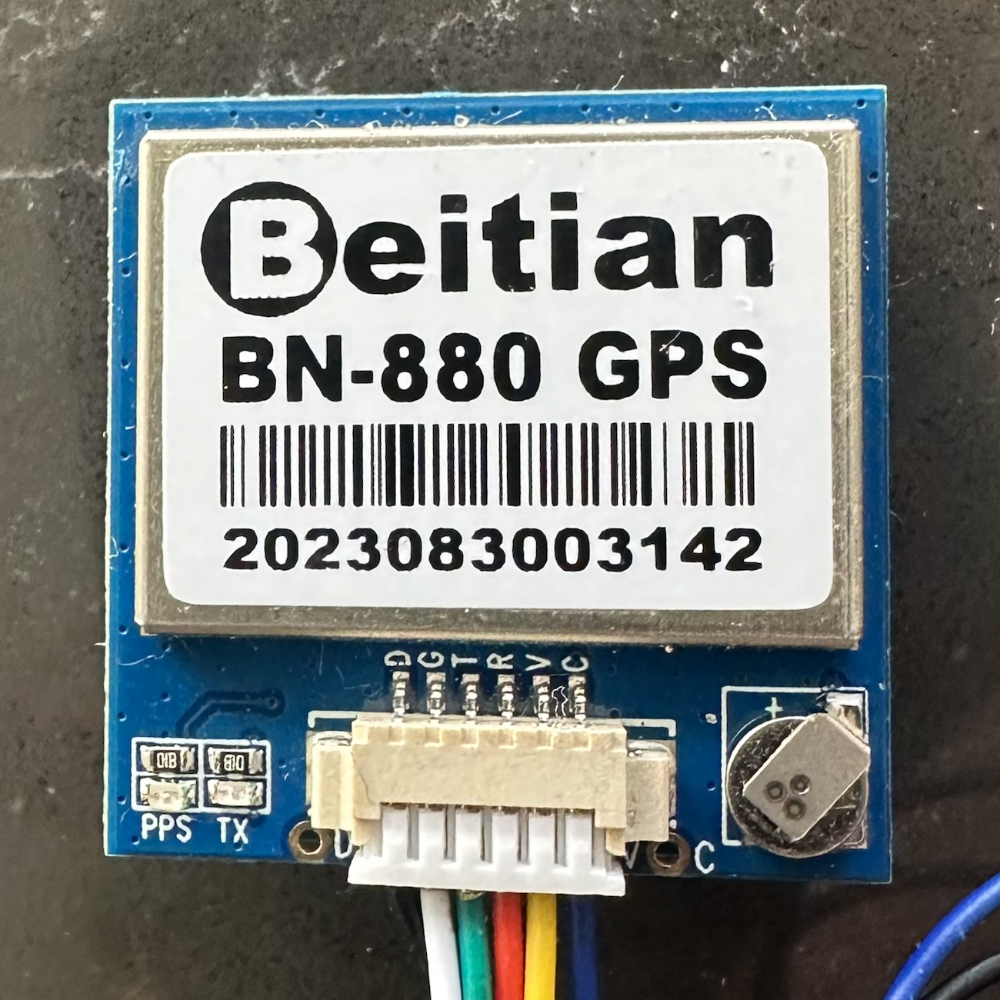
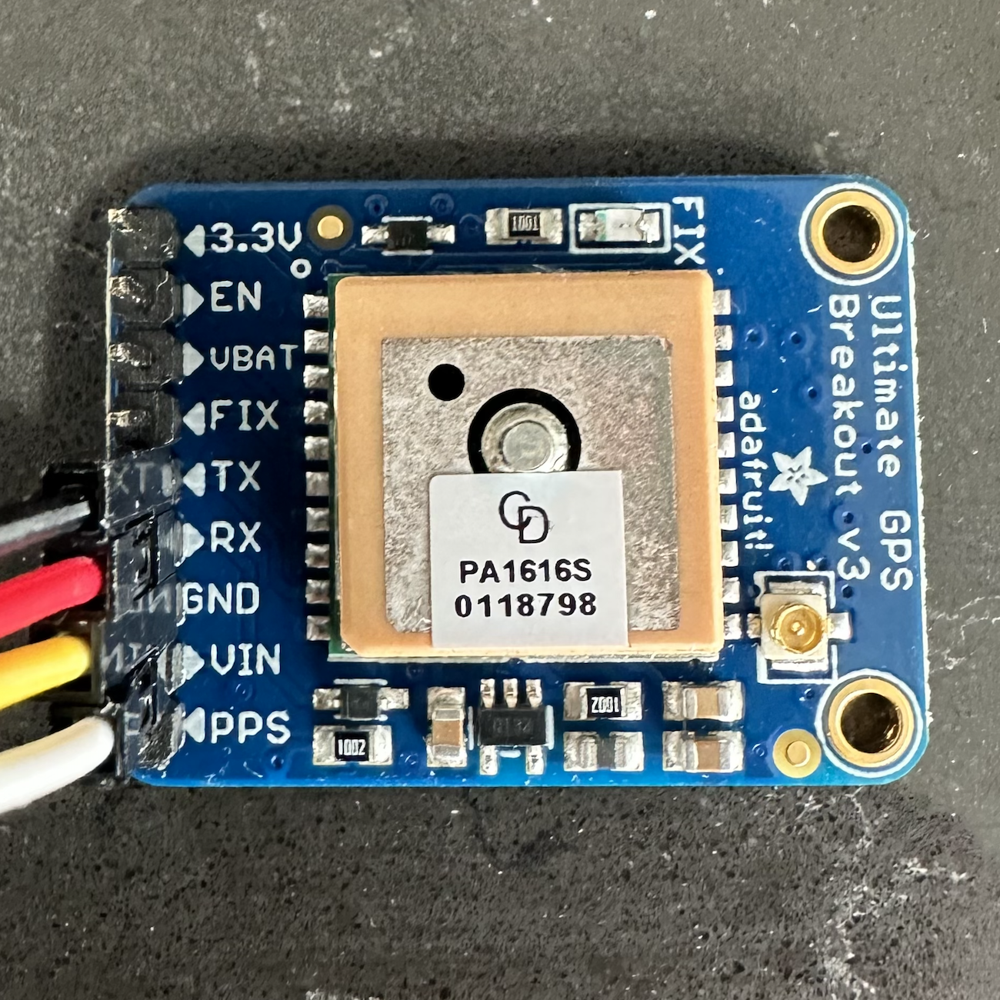
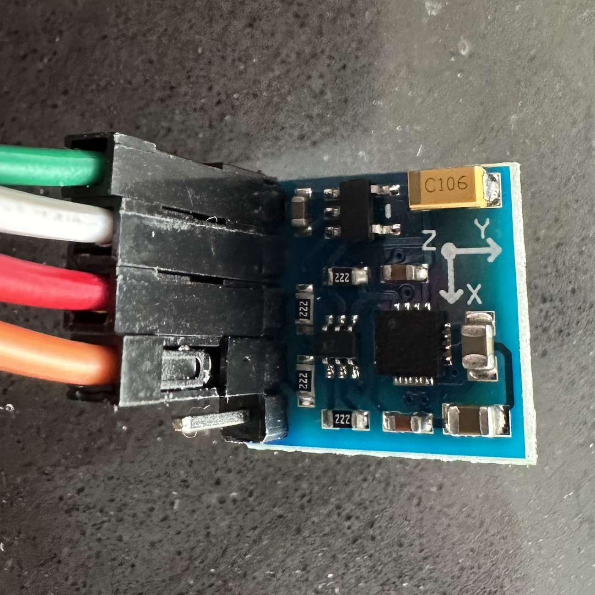

# Sensors
{: .no_toc }

## Table of contents
{: .no_toc .text-delta }

1. TOC
{:toc}
---

# 11/06/2023
## GPS Selection Progress
* GPS breakout board capable of tracking 22 satellites across multiple channels
* 10 location updates per second with a minimal 20A power draw
* Velocity accuracy to 0.1m, which adheres to GPS standard of < 3m
* External compass with 1 degree heading accuracy

# 11/17/2023
## Acquired GPS' & Compass
### BN-880 GPS

### Adafruit GPS

### GY-271 Compass

# 11/18/2023
## Caddy (Raspberry Pi) Progress
* Able to get the Raspberry Pi’s GPS coordinates with the BN-880 GPS
* Able to get the Raspberry Pi’s cardinal direction with the GY-271 Compass
* [Corresponding Software Work](#caddy-raspberry-pi-progress)