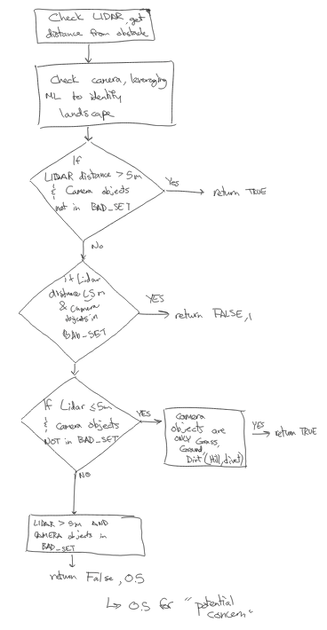
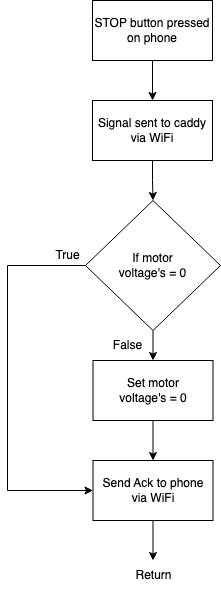
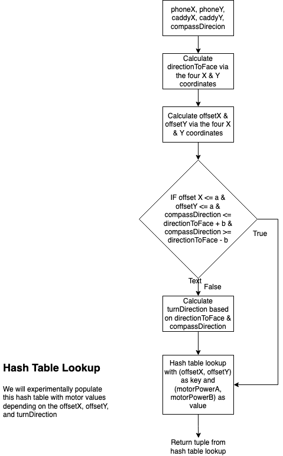

# Software
{: .no_toc }

## Table of contents
{: .no_toc .text-delta }

1. TOC
{:toc}
---

# 11/07/2023
## Software Design Progress
**In general:**
* The server and client network will be connected via Wi-Fi to support extended range​
* The user's phone transmits actions and coordinates​ to the caddy
* The caddy follows the user's requested actions and coordinates in real-time

**Phone:**
* Sends the requested action to the caddy (START/STOP)
* Sends the coordinates of the phone, using the phone’s built in GPS​, to the caddy in real-time
* Receives the distance to caddy in real-time from the caddy

**Caddy (Raspberry Pi):**
* Receives action from phone​
    * If STOP​
        * Turn off all sensors
        * Use minimal motor power to remain stationary​
    * If START​
        * Continuously receive coordinates from the phone​
        * Calculate current coordinates and cardinal direction​
        * Transmit current distance from the phone to the phone​
        * Use appropriate motor power to follow phone

**Obstacle Detection:**
* LiDAR to determine the distance to nearest surface/hazard
* Camera to use YOLOv6 algorithm for image recognition (mAP > 50%)​
    * Differentiate between hazards and areas of interest
    * Recognize potential hazards in peripherals (water, ditches, etc.)

**Control:**
* Controller for converging on correct angle to follow phone
* Controller for speed
    * Track user faster at further distances
    * Stop 5m away from the user

# 11/13/2023
## Software Block Diagrams
### Obstacle Avoidance

### Obstacle Detection

### Phone

### Speed

### Start

### Stop

### Turn Direction


# 11/16/2023
## Phone Progress
* Able to get the phone's GPS coordinates and display them to the user


**Code Snippet:**
```swift
override func viewDidAppear(_ animated: Bool) {
    super.viewDidAppear(animated)
    manager = CLLocationManager()
    manager?.delegate = self
    manager?.desiredAccuracy = kCLLocationAccuracyBest
    manager?.requestWhenInUseAuthorization()
    manager?.startUpdatingLocation()
}
    
func locationManager(_ manager: CLLocationManager, didUpdateLocations locations: [CLLocation]) {
    guard let first = locations.first else {
        return
    }
        
    label.text = "\(round(first.coordinate.latitude*1000000000)/1000000000), \(round(first.coordinate.longitude*1000000000)/1000000000)"
}
```

# 11/18/2023
## Caddy (Raspberry Pi) Progress
* Able to get the Raspberry Pi's GPS coordinates with the BN-880 GPS

**Code Snippet:**
```python
if str.find('GGA') > 0:
    msg = pynmea2.parse(str)
    print("Timestamp: %s -- Lat: %s %s -- Lon: %s %s -- Altitude: %s %s -- Satellites: %s" % (msg.timestamp,msg.latitude,msg.lat_dir,msg.longitude,msg.lon_dir,msg.altitude,msg.altitude_units,msg.num_sats))
```

* Able to get the Raspberry Pi's cardinal direction with the GY-271 Compass

**Code Snippet:**
```python
sensor = GY271.compass(address=0x0d)
angle = sensor.get_bearing()
print('Heading Angle = {}°'.format(angle))
```

* [Corresponding Sensors Work](#acquired-gps--compass)

# 11/20/2023
## Phone & Caddy (Raspberry Pi) Progress
* Able to send coordinates between the phone and Raspberry Pi on a socket


**Phone Code Snippet:**
```swift
func sendMessage(message: String) {
    if connected == false {
        return
    }
    guard let data = message.data(using: .utf8) else {
        return
    }
    _ = data.withUnsafeBytes { outputStream?.write($0, maxLength: data.count)}
}

func locationManager(_ manager: CLLocationManager, didUpdateLocations locations: [CLLocation]) {
    guard let first = locations.first else {
        return
    }
        
    label.text = "\(round(first.coordinate.latitude*1000000000)/1000000000), \(round(first.coordinate.longitude*1000000000)/1000000000)"
    if let labelText = label?.text {
        let encodedMessage = "COORDINATE:\(labelText)"
        sendMessage(message: encodedMessage)
    }
}
```

**Raspberry Pi Code Snippet:**
```python
message = connectionSocket.recv(1024).decode()
code, content = message.split(":", 1)
if code == ACTION:
    print(f"Incoming action: {content}")
else:
    phone_location = content.split(", ")
    phone_location_lat = float(phone_location[0])
    phone_location_lon = float(phone_location[1])
    print(f"Coordinates: {phone_location_lat}, {phone_location_lon}")
```

# 11/23/2023
## Caddy (Raspberry Pi) Motor Control
* Able to successfully control the hoverboard's motors with a Raspberry Pi. The wheels can rotate in both directions and the brake can be successfully applied
* [Corresponding Electrical Work](#motor-work-progress-2)

**Code Snippet:**
```python
def init():
    GPIO.setmode(GPIO.BOARD)
    GPIO.setwarnings(False)
    GPIO.setup(29, GPIO.OUT)
    GPIO.setup(31, GPIO.OUT)
    GPIO.setup(32, GPIO.OUT)

def forward(tf): 
    GPIO.output(29, False)
    GPIO.output(31, False)
    motorl = GPIO.PWM(32, 50)
    motorl.start(0)
    motorl.ChangeDutyCycle(20)
    time.sleep(tf)

def reverse(tf): 
    GPIO.output(29, True)
    GPIO.output(31, False)
    motorl = GPIO.PWM(32, 50)
    motorl.start(0)
    motorl.ChangeDutyCycle(20)
    time.sleep(tf)

def brake(tf): 
    GPIO.output(31, True)
    time.sleep(tf)
```

# 1/10/2024
## Caddy (Raspberry Pi) Progress
* Able to get accurate distance measurements from the LiDAR sensor
* [Corresponding Sensors Work](#lidar)

**Code Snippet:**
```python
def read_tfluna_data():
    while True:
        counter = ser.in_waiting # count the number of bytes of the serial port
        if counter > 8:
            bytes_serial = ser.read(9) # read 9 bytes
            ser.reset_input_buffer() # reset buffer

            if bytes_serial[0] == 0x59 and bytes_serial[1] == 0x59: # check first two bytes
                distance = bytes_serial[2] + bytes_serial[3]*256 # distance in next two bytes
                strength = bytes_serial[4] + bytes_serial[5]*256 # signal strength in next two bytes
                temperature = bytes_serial[6] + bytes_serial[7]*256 # temp in next two bytes
                temperature = (temperature/8.0) - 256.0 # temp scaling and offset
                return distance/100.0,strength,temperature

distance, strength, temperature = read_tfluna_data()
```

# 2/7/2024
## Caddy (Raspberry Pi) Progress
* Able to get the GPS, Compass, and LiDAR working in unison on the caddy
* [Corresponding Sensors Work](#caddy-raspberry-pi-progress-1)

**Code Snippet:**
```python
while True:
    message = connectionSocket.recv(1024).decode()
    print(f"Raw content: {message}")
    code, content = message.split(":", 1)

    # Obstacle detection case, wait for phone to transmit "ACTION:START"
    if GLOBAL_OBSTACLE_STOP is True:
        if code == ACTION and content == "START":
            GLOBAL_OBSTACLE_STOP = False
        else:
            # TURN OFF MOTORS
            while code != ACTION and content != "START":
                message = connectionSocket.recv(1024).decode()
                code, content = message.split(":", 1)

    if code == ACTION:
        print(f"Incoming action: {content}")
        connectionSocket.send("SETUP:SETUP".encode())
    else:
        if lat_avg == []:
            pi_location_lat, pi_location_lon, last, lat_avg, lon_avg = get_rpi_coordinates()
        else:
            pi_location_lat, pi_location_lon, last, lat_avg, lon_avg = get_rpi_coordinates(last, lat_avg, lon_avg)

        print(f"pi lat: {pi_location_lat}, pi lon: {pi_location_lon}")

        phone_location_lat, phone_location_lon = parse_location(content)

        distance_from_phone = distance(pi_location_lat, pi_location_lon, phone_location_lat, phone_location_lon)
        distance_from_phone = "PI:" + str(round(distance_from_phone, 2))

        # compute direction to turn towards
        direction_to_turn, cardinal_direction = calculate_angle_offset(pi_location_lat, pi_location_lon, phone_location_lat, phone_location_lon)

        # FOR NOW KEEPING THE BELOW CODE HERE BECAUSE WE HAVE THE SOCKET HERE AS WELL
        obstacle_distance, strength = detection()
        print(f"obstacle_distance: {obstacle_distance}, strength: {strength}")

        # TODO!
        get_compass_bearing(direction_to_turn)

        # pre-screening, may need to adjust strength threshold
        if obstacle_distance >= 0.2 and obstacle_distance <= 5 and strength >= 900 and False:
            connectionSocket.send("ACTION:STOP".encode())
            GLOBAL_OBSTACLE_STOP = True
        
        # probably should be else. Ideally, we receive one message, then send one message.
        else:
            print(f"LAST PRINT: Pi's distance from phone: {distance_from_phone}")
            connectionSocket.send(distance_from_phone.encode())
```