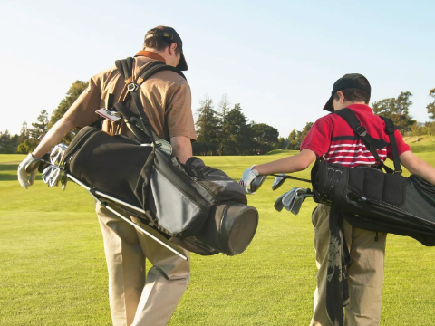
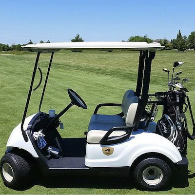
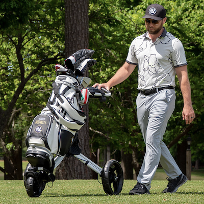
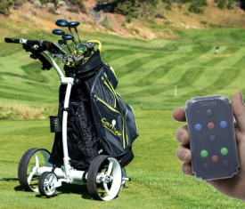
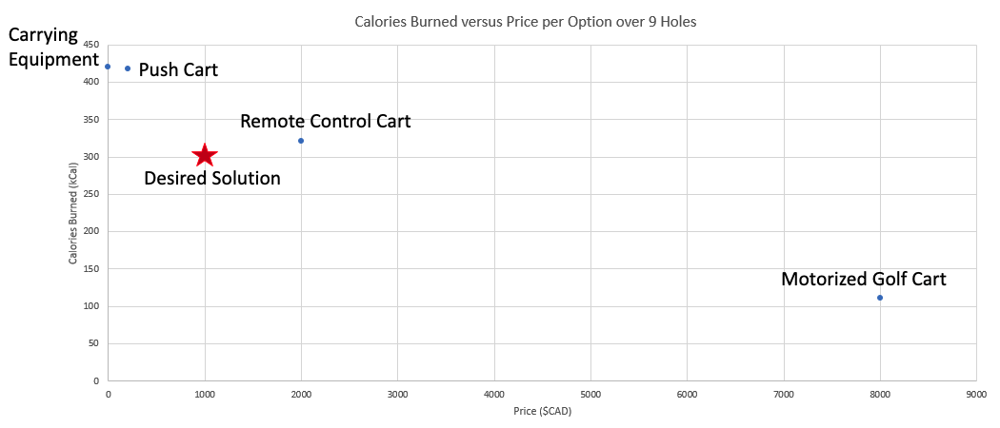

# **Introducing GolfTom - Your Ultimate Golf Companion**​ 
## **GolfTom is a cutting-edge autonomous caddy that seamlessly accompanies you throughout the golf course, enhancing your game with unparalleled convenience and innovation.**
## **Current status of GolfTom:**

## **The current methods of transportation for golf equipment on the golf course are not suitable for all players of the game​.**

|  |  |  |  |
| Carrying Clubs | Motorized Golf Cart | Pushcart | Remote Control Cart |
|:--------------------|:-------------------|:-------------------|:-------------------|
| Weigh over 35lbs on average | Priced per visit | Difficult to push in mushy/elevated terrains | Extremely expensive |
| Heavy strain on the shoulders| Golfers still need to carry golf bag on each hole | Tiring to push for multiple hours | Tedious to control |
| Requires over 175lbs bodyweight to safely carry | Many golfers prefer to walk the golf course | Cannot be easily placed on elevated terrains | Complicated to use/learning curve |

# Current Methods vs Desired Solution

## **_Our goal is to provide a means to transport golf equipment across the golf course with minimum strain and interaction from the user at a fair price point._**

# Criteria, Constraints, & Specifications
### We outlined criteria, constraints, and specifications which our solution would adhere to in MTE481's final report. These requirements along with how our solution meets them are outlined in the tables below.

## **Criteria**

| Criteria | Status | Notes | Proof |
|:--------------------|:-------------------|:-------------------|:-------------------|
| Rechargeable and detachable battery | Pass | xxx | xxx |
| Sufficient battery range for 18 holes of golf (4.5 hours) | Pending | xxx | xxx |
| Accommodate standard golf bags with clubs  | Pass | xxx | xxx |
| Travel at a human's walking pace (5 KM/H) | Pass | xxx | xxx |
| Obstacle detection radius of 3 metres | Pass | xxx | xxx |
| Failure detection and alerts | Pass | xxx | xxx |
| Pairing device is convenient for user to carry and easily transportable | Pass | xxx | xxx |

## **Constraints**

| Constraints | Status | Notes | Proof |
|:--------------------|:-------------------|:-------------------|:-------------------|
| Can traverse up/down terrains with max slope of 20 degrees | Pending | xxx | xxx |
| Weight of the entire solution does not exceed 15 KG without clubs | Pending | xxx | xxx |
| System dimensions do not exceed 47 inches x 42 inches x 27 inches (1.19 metres x 1.1 metres x 0.69 metres) | Pass | xxx | xxx |
| Pairing device dimensions do not exceed 7 inches x 5 inches x 1 inch (0.18 metres x 0.13 metres x 0.025 metres) | Pass | xxx | xxx |
| Total cost does not exceed $2000 CAD | Pass | xxx | xxx |

## **Specifications**

| Specifications | Status | Notes | Proof |
|:--------------------|:-------------------|:-------------------|:-------------------|
| 50 LB payload capacity | xxx | xxx | xxx |
| 2 DC motors combining to 15+ Nm | xxx | xxx | xxx |
| 123+ RPM | xxx | xxx | xxx |
| Power output of 200+ W | xxx | xxx | xxx |
| 42000 mAh battery | xxx | xxx | xxx |
| IPx5 Rating | xxx | xxx | xxx |
| Wi-Fi network connection for pairing device and system | xxx | xxx | xxx |

----